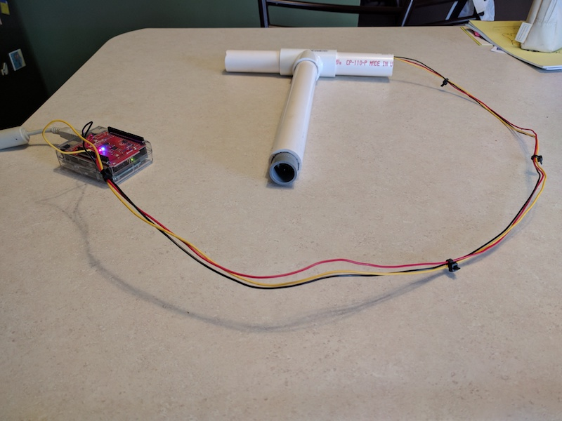

## Arduino Sump Well Water Sensor
This project includes Arduino sketch code required to run an Arduino water sensor system. This system continuously monitors output from a SST Liquid Level Switch and notifies the configured phone number via SMS message if the sensor reports water. The T-shaped PVC housing holds the water sensor and allows it to sit on top of the sump well cover and dip down in.

### Hardware Components
* #### Arduino Uno R3
* #### [Arduino Enclosure](https://www.sparkfun.com/products/12838)
* #### [SparkFun ESP8266 Wifi Shield](https://www.sparkfun.com/products/13287)
* #### [SST Liquid Level Switch LLC200D3SH-LLPK1](https://www.sparkfun.com/products/13835)
* #### 1" PVC, T connector
* #### 1" to 1/2" gray PVC reducer bushing  
* #### 22AWG wire

### Software Components
* #### Arduino sketch
  * [SparkFun ESP8266 Wifi library](https://github.com/sparkfun/SparkFun_ESP8266_AT_Arduino_Library) v1.0.0
  * [AES library](http://utter.chaos.org.uk/~markt/AES-library.zip) Unknown version
  * [Base64 library](https://github.com/Densaugeo/base64_arduino/tree/1.0.0) v1.0.0
* #### [NodeJS proxy](https://github.com/flawless2011/node-water-sensor)
* #### [Twilio SMS API](https://twilio.com)

The Arduino sketch monitors the water sensor. After detecting water for 30 seconds continuously, it encrypts the message payload and sends to the NodeJS proxy. The proxy decrypts the JSON payload and then calls Twilio. After sending the message, the Arduino sleeps for 30 minutes and then begins water detection again. This allows continual SMS messaging every 30 minutes while water remains present at the sensor.
